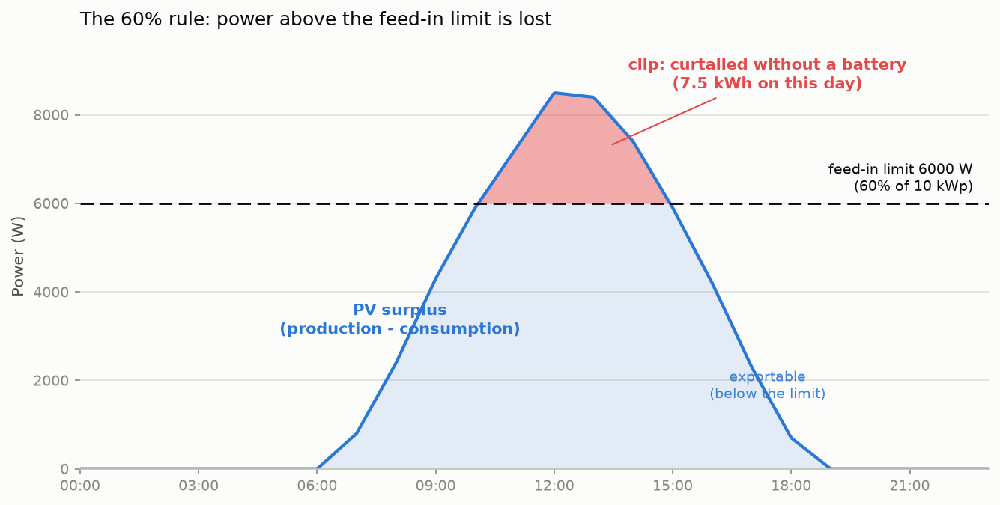
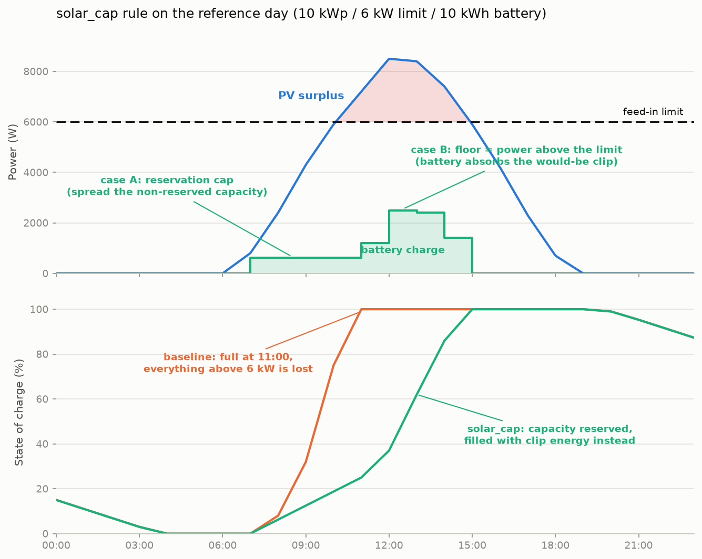
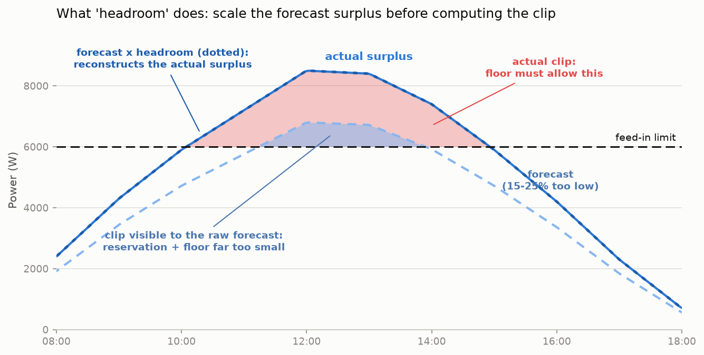

# Evaluation: Solar feed-in limit (Solarspitzengesetz) in peak shaving

Status: **evaluation and simulation phase** — not yet integrated into `logic/next.py`.
Simulation script: [`scripts/simulate_solar_limit_day.py`](https://github.com/MaStr/batcontrol/blob/main/scripts/simulate_solar_limit_day.py),
figures generated by `scripts/plot_solar_limit_day.py`.

## Background: the 60% rule

The German "Solarspitzengesetz" (in force since 2025-02-25) limits uncontrolled PV
plants (no iMSys + control box) to feeding at most **60% of their installed power**
into the grid at the grid connection point (Sec. 9 (2) no. 3 EEG). The inverter
enforces the limit hard: production above it is **curtailed and lost**, unless it is
self-consumed or charged into the battery.

For a 10 kWp plant this means at most 6,000 W of feed-in. On a clear summer day
peaking at ~8.9 kW, several hours sit above the limit; without countermeasures about
**7.5 kWh are lost** on such a day (see the reference scenario below).



Important: this is a **power limit, not an energy limit**. The losses concentrate on
the midday peak — exactly the window in which a naively charged battery has long
been full.

## Terminology

| Term | Meaning |
|------|---------|
| **clip** | The part of the PV surplus above the feed-in limit — the energy the inverter curtails (loses) unless the battery absorbs it. Red area in the figures. |
| **cap** | An upper limit on the PV-to-battery charge rate (`limit_battery_charge_rate` in W). Today's peak-shaving rules emit caps to *delay* charging. `-1` = no cap, `0` = block charging. |
| **floor** | A lower bound on the allowed charge rate during clip slots: the battery must be *permitted* to charge at least the power above the feed-in limit. With a greedy-charging inverter a floor never forces charging — it only raises the applied cap, and the inverter charges `min(actual surplus, cap)`. |
| **reservation** | Free battery capacity held back before the clip window so it is still available when clipping starts. Implemented as a cap (case A below). |
| **headroom** | A safety factor >= 1.0 multiplied onto the *forecast surplus* before computing the clip. Solar forecasts systematically underestimate peaks; headroom reconstructs the higher real curve so reservation and floor are sized correctly. |

## Key finding: today's peak shaving can cause curtailment

The existing peak-shaving rules (`time`/`price`) emit a **cap** on the PV charge
rate. When the PV surplus exceeds the feed-in limit, that cap blocks exactly the
energy that should go into the battery — the difference is curtailed. In the
reference scenario, plain time-based shaving curtails 1.8 kWh that the new rule
recovers completely.

Conversely, time-based shaving already helps partially (76% recovery vs. 0%
baseline) because it shifts capacity into the afternoon — but uncoordinated and
without any guarantee.

## Proposed algorithm: the "solar_cap" rule

The rule works on the existing forecast arrays (Wh per interval, index 0 = now) and
distinguishes two cases. Per slot `k` (up to the end of the production window):

```
surplus_wh[k]    = max(0, production[k] - consumption[k])
feed_allow_wh[k] = feed_in_limit_w * slot_h[k]
clip_wh[k]       = min(surplus_wh[k], max(0, surplus_wh[k] - feed_allow_wh[k]) * headroom)
```

**Case A — before the clip window: reservation cap.**
Free capacity minus the predicted clip energy is spread evenly over the slots until
the window starts. If the required reserve exceeds the free capacity, PV charging is
blocked entirely (cap 0). This prevents exportable energy from displacing clip
energy in the battery 1:1.

**Case B — inside the clip window: floor + capacity-preserving cap.**

```
floor_w = clip_wh[0] / slot_h[0]
cap_w   = -1                                if total surplus <= free capacity
        = floor_w + extra_wh / remaining_h  otherwise (extra = free cap. - remaining clip)
```

Under scarcity (`extra = 0`) the cap equals the floor: the battery absorbs **only**
clip energy; everything below the limit is fed into the grid. No prioritization
inside the window is needed — every absorbed clip Wh has equal value; the only
harmful move is filling capacity with exportable energy.



## Configuration design: one switch per rule

With three rule flavors (target time, price, solar) the previous `mode` string
(`time`/`price`/`combined`) becomes confusing. Agreed design: **one explicit switch
per rule**; `mode` is deprecated and mapped onto the switches at load time
(`time` -> `time_active`, `price` -> `price_active`, `combined` -> both):

```yaml
peak_shaving:
  enabled: false                 # master switch (as today, incl. evcc override)
  time_active: true              # target-time rule (counter-linear ramp)
  price_active: false            # price rule (reserve for cheap windows)
  solar_cap_active: false        # NEW: clip absorption (feed-in limit)
  allow_full_battery_after: 14   # parameter of the target-time rule
  price_limit: 0.05              # parameter of the price rule
  feed_in_limit_w: 0             # parameter of the solar rule: feed-in limit in W.
                                 # 0 = neutral (rule has no effect even if
                                 # solar_cap_active is true). Formula: 0.6 * kWp * 1000
  feed_in_limit_headroom: 1.0    # safety factor >= 1.0 on the forecast surplus
                                 # (see terminology and scenario 4b)
```

`feed_in_limit_w` is deliberately an **absolute watt value**: the installed power
(kWp) exists in the config only for fcsolar `pvinstallations` (not at all for
Solcast), and the limit applies at the grid connection point of the whole plant.
`0` is the neutral value — in addition to the switch, so an unconfigured limit can
never be misread as "0 W of feed-in allowed".

### Relation to production_offset_percent

`battery_control_expert.production_offset_percent` also scales the production
forecast, so the overlap was evaluated. Measured inside the solar rule the two
knobs are indeed equivalent — same effect, same trade-off:

| Setting (rule view)                  | Recovery at +25% error | Recovery with correct forecast |
|--------------------------------------|-----------------------:|-------------------------------:|
| `production_offset_percent: 1.25`    | 100.0%                 | 58.7%                           |
| `feed_in_limit_headroom: 1.25`       | 94.7%                  | 62.7%                           |

They differ in **scope**, which is why the rule gets its own key:

- `production_offset_percent` is applied globally in `core.py` before the forecast
  enters the logic. A value > 1 distorts every downstream decision: less grid
  recharge is planned, discharge decisions become more generous, time/price caps
  engage too early. Its documented purpose is the opposite direction (winter mode
  `0.7`, snow, degradation).
- `feed_in_limit_headroom` affects only the solar rule's reservation and floor.
  The clipping-relevant forecast error is a *shape* error (underestimated midday
  peak on clear days), not a whole-day energy error.

**Do not use `production_offset_percent` (> 1) to tune clip absorption.** The two
compose cleanly instead: the solar rule consumes the already offset-adjusted
production array, so a winter user at `0.7` automatically gets a conservative
(smaller) clip prediction — harmless, since nothing clips in winter.

### Priorities between the rule flavors

Documented, fixed order of precedence (no configuration needed):

1. **`enabled` (master)** off -> no rule acts (incl. the evcc runtime override).
2. **Force-charge from grid (MODE -1)** overrides all peak shaving (as today).
3. **All active cap rules** (target-time ramp, price reserve, solar reservation)
   each emit a limit; the **strictest wins** (`min`, like today's `combined`).
4. **The solar floor overrides every cap**: `final = max(floor, min(caps))`.
   Rationale: caps optimize economics (shift charging), the floor prevents
   **physical loss** (curtailment). A cap below the floor would destroy energy.
   The floor therefore also applies **after** `allow_full_battery_after` and at
   high SoC (`always_allow_discharge` region) — the clip window physically lasts
   longer than the target hour. Consequence: the solar reservation may let the
   battery reach 100% only after the target hour; lost energy weighs more than a
   late-full battery.
5. **Static inverter clamps** last (`max_pv_charge_rate` as upper bound, 500 W
   minimum via `enforce_min_pv_charge_rate`). Caution: a configured
   `max_pv_charge_rate` below the floor makes curtailment physically unavoidable
   -> startup warning planned.

Sentinel semantics stay unchanged: `-1` = no limit, `0` = block charging. `-1`
automatically satisfies every floor because the inverter then charges surplus
greedily anyway — **no new inverter mode** is needed; the floor is the guarantee
`applied cap >= floor`.

## Simulation results

All numbers from `scripts/simulate_solar_limit_day.py` (reference: 10 kWp south,
clear summer day, 8.9 kW peak, 6,000 W limit, 10 kWh battery, 400 W base load,
starting SoC 15%, hourly resolution). "Recovery" = share of the energy curtailed
without a battery that is saved.

### Scenario 1 — reference day

| Trace                             | Feed-in   | Curtailed | Recovery  |
|-----------------------------------|----------:|----------:|----------:|
| Baseline (all rules off)          | 40.50 kWh | 7.50 kWh  | 0%        |
| Only `time_active` (today)        | 46.20 kWh | 1.80 kWh  | 76.0%     |
| Only `solar_cap_active`           | 48.00 kWh | 0.00 kWh  | **100%**  |
| `time_active + solar_cap_active`  | 48.00 kWh | 0.00 kWh  | **100%**  |

The end-of-day SoC is identical in all traces (83.3%) — the rule gives nothing
away, it only changes **what** the battery is filled with. Visible in the slot
detail: before the window the reservation cap limits charging to 625 W; from 11:00
the floor lifts the charge rate to exactly the clip power (1,200 -> 2,500 -> 2,400
-> 1,400 W) while feed-in stays pinned at 6,000 W. In the combined trace the floor
overrides the time-ramp cap exactly when that cap would cause curtailment.

### Scenario 2 — east-west profile (5.6 kW peak < limit)

No clipping expected; the rule stays completely inert — trace bit-identical to the
baseline (regression check passed, no false positives).

### Scenario 3 — small battery (5 kWh, scarcity)

Free capacity at window start 5.00 kWh, clip potential 7.50 kWh:

| Trace                   | Curtailed | Recovery |
|-------------------------|----------:|---------:|
| Baseline                | 7.50 kWh  | 0%       |
| Only `solar_cap_active` | 2.50 kWh  | 66.7%    |

Recovered: **5.00 kWh = exactly the free capacity at window start** — the
theoretical maximum. The reservation blocks all morning PV charging (cap 0, feed-in
continues below the limit), inside the window `cap == floor` holds.

### Scenario 4 — forecast error (forecast = 85% of actual)

| Trace                     | Curtailed | Recovery |
|---------------------------|----------:|---------:|
| Baseline                  | 7.50 kWh  | 0%       |
| solar, headroom 1.0       | 4.96 kWh  | 33.8%    |
| solar, headroom 1.2       | 4.46 kWh  | 40.6%    |
| solar, headroom 1.5       | 4.23 kWh  | 43.5%    |
| solar, perfect forecast   | 0.00 kWh  | 100%     |

Findings: (a) the algorithm is clearly forecast-sensitive — a 15% underestimation
of production underestimates the clip disproportionately (the clip is the "tip" of
the curve). (b) Headroom applied to the clip energy improves the reservation only
moderately (+7 points at 1.2), because inside the window the **floor** is also
computed from the too-low forecast. The mitigation plan derived from this is
developed and quantified in scenario 4b.

### Scenario 4b — severe forecast error (actual = 125% of forecast)

The forecast sees only **1.36 kWh** of clip potential instead of the real 7.50 kWh
and does not recognize entire clip slots (11:00, 14:00) as such at all — a
multiplier on the predicted clip energy structurally cannot repair that. Since
batcontrol has **no live measurement of the current production**, only
forecast-based mitigations are available; two were implemented and compared:

- **Headroom on the surplus** (`headroom_on='surplus'`): the factor is applied to
  the forecast surplus before the clip computation. This reconstructs an
  underestimated production curve and also finds clip slots the raw forecast
  misses — it repairs the **reservation** before the window.
- **Headroom floor** (`floor_source='headroom'`): the floor inside the window is
  computed from the headroom-corrected instead of the raw clip. With greedy
  charging inverters the floor is only a **permission** anyway (the applied cap is
  raised, the inverter charges `min(actual surplus, cap)`) — charging that does
  not physically exist is never forced. It repairs the **absorption** inside the
  window.



Results under both conditions (actual = 125% of forecast vs. forecast correct):

| Setting                                 | Recovery at +25% error | Recovery with correct forecast |
|-----------------------------------------|-----------------------:|-------------------------------:|
| headroom 1.25 on clip (raw floor)       | 38.7%                  | —                               |
| headroom 1.25 on surplus (raw floor)    | 31.8%                  | —                               |
| surplus 1.1 + headroom floor            | 44.9%                  | 94.5% (loss 0.41 kWh)           |
| surplus 1.25 + headroom floor           | **94.7%**              | 62.7% (loss 2.80 kWh)           |
| neutral (headroom 1.0)                  | 31.8-38.7%             | **100%**                        |

Key insights:

1. Both measures are effective **only together**: without the headroom floor the
   perfect reservation is worthless (the forecast-based cap blocks charging while
   real clipping happens — which is why "surplus alone" is even slightly worse
   than "clip alone"); without the surplus headroom the battery is already
   pre-filled when the window starts.
2. **Without a live measurement the headroom is a genuine trade-off**: its value
   must roughly match the typical forecast error. Too high a value (1.25 with a
   correct forecast) charges exportable energy inside the window and displaces
   clip energy 1:1 on capacity-scarce days (2.8 kWh loss). Too low a value leaves
   clip energy on the table.
3. **1.1 is the robust compromise**: it costs only 0.41 kWh with a correct
   forecast and already improves the error case noticeably.

**Forecast-error plan (settled for the integration, forecast-only):**

1. **`feed_in_limit_headroom` acts on the forecast surplus** and the **floor is
   computed from the headroom-corrected clip** (one shared knob, no second config
   key). Default `1.0` (neutral, lossless with a correct forecast); documented
   recommendation `1.1`, up to `1.25` for known-pessimistic forecast sources.
2. Document the side effects: headroom > 1 can trigger an unnecessary reservation
   on days just below the limit (battery full later, no energy loss) and can
   displace a small part of the clip on capacity-scarce clipping days with a
   correct forecast (quantified above).
3. The 15-minute resolution (`time_resolution_minutes: 15`) additionally reduces
   the systematic part of the error (scenario 6).
4. **Future option** (requires a new data path): a live measurement of the
   current production/feed-in would make the floor forecast-independent and
   dissolve the trade-off — batcontrol does not capture these values today.

### Scenario 5 — midday consumption spike (2.4 kW, 12-14h)

Self-consumption lowers the clip potential to 3.50 kWh; the combination
`time + solar_cap` recovers 100% (baseline 0%, time-only 60%).

### Scenario 6 — 15-minute resolution

Consistency check on the interpolated reference day: 99.1% recovery (residual loss
of 0.07 kWh from interpolation edges at slot boundaries). The 15-minute resolution
additionally reduces the systematic "hourly average understates instantaneous
clipping" error.

## Assessment

The algorithm meets the requirements:

1. **It saves the "40%"**: 100% recovery with a correct forecast, exactly the
   physical maximum with a scarce battery.
2. **It fixes a defect**: without the floor, the existing peak shaving itself
   causes losses on clipping days (1.8 kWh on the reference day).
3. **It is minimally invasive**: no new inverter mode, no new data source, same
   sentinel semantics, additive as a post-processing step.
4. **It is neutral when it has nothing to do** (east-west scenario) and fully
   disengageable via `feed_in_limit_w: 0` or `solar_cap_active: false`.

Known limits: forecast sensitivity (scenarios 4/4b) — without a live measurement
of the current production (currently not part of batcontrol) the headroom remains
a trade-off whose value must match the typical forecast error (recommendation
1.1); hourly average vs. instantaneous power (a slot averaging just below the
limit can still clip briefly — partially covered by headroom).

## Integration roadmap (follow-up step)

1. `logic/logic_interface.py`: extend `PeakShavingConfig` with `time_active`,
   `price_active`, `solar_cap_active`, `feed_in_limit_w` (default 0 = neutral) and
   `feed_in_limit_headroom` (default 1.0); deprecate `mode` and map it onto the
   switches in `from_config()` (log a warning); validation analogous to
   `price_limit`.
2. New `logic/solar_limit.py`: take `compute_solar_limit()` and `merge_limits()`
   from the simulation script unchanged (pure functions, pattern:
   `grid_charge_target.py`).
3. `logic/next.py`: own post-processing step `_apply_solar_limit()` **after**
   `_apply_peak_shaving()` with its own (smaller) skip list: also runs at high SoC
   and after `allow_full_battery_after`; still skips on force-charge and on
   `allow_discharge == False` (there the inverter charges surplus unrestricted
   anyway). Merge according to the priority rule above;
   `enforce_min_pv_charge_rate` once on the final merged value. Extract the helper
   `_remaining_interval_hours()` (partial slot 0, cf. the grid-recharge block).
   `feed_in_limit_headroom` acts on the forecast surplus and the floor uses the
   headroom-corrected clip (`headroom_on='surplus'`, `floor_source='headroom'` in
   the simulation script; trade-off see scenario 4b).
4. `core.py`: startup warning when `feed_in_limit_w > 0` and
   `max_pv_charge_rate > 0`.
5. Tests: `tests/batcontrol/logic/test_solar_limit.py` (pure functions) +
   integration cases in `test_peak_shaving.py` (floor overrides cap incl. cap 0,
   reservation, scarcity `cap == floor`, neutral value = bit-identical behavior,
   sentinels, partial slot 0, 15-min, mode deprecation mapping).
6. `config/batcontrol_config_dummy.yaml` + `docs/features/peak-shaving.md` +
   HA add-on mirroring (`MaStr/batcontrol_ha_addon`).
7. Open for the integration: live measurement as floor source for slot 0 (see
   scenario 4b); active discharging before the window (deferred, passive
   reservation only); MQTT topic `predicted_clip_wh` (read-only, optional).
