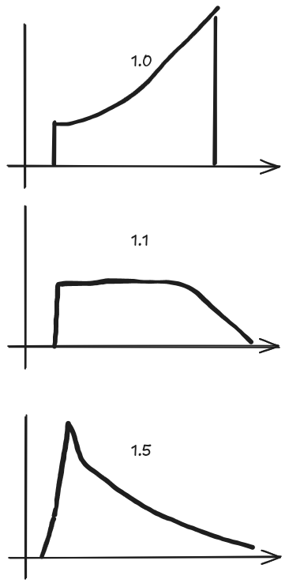

# Adjust the charging rate on a charging event
* Config option: `charge_rate_multiplier`
* Default: 1.1

When Batcontrol reaches the lowest point in the price curve, it determines which future hours exceed a minimum price threshold. For those hours, it retrieves the required Wh from the load profile, and those Wh are then recharged.

```
charge_rate = required_recharge_energy/remaining_time
charge_rate * charge_rate_multiplier = final_charge_rate
if final_charge_rate < 500W  then charge_rate = 500W 
```

Example:

We are currently at a price of €0.30. We plan to recharge for two hours during which the price will exceed €0.35, and we will need 600 Wh and 400 Wh respectively. The battery is empty, so we recharge a total of 1,000 Wh. Because there are conversion losses, we use the charge_rate_multiplier to increase the charging power:

```1,000 Wh * 1.1 = 1,100 W```

With a multiplier value of 1.0, you may observe that the charging power ramps up over the course of the hour because the setpoints are reached too slowly. At a value of 1.5, the target is reached more quickly and then charging slows steadily as the hour progresses.



# Adjust Charging pricepoint
* Config options:
  * `soften_price_difference_on_charging` ; true / false  - Enable / Disable
  * `soften_price_difference_on_charging_factor` ; 5
* Default: disabled

By default, Batcontrol checks:
```python
found_lower_price = future_price <= current_price
```
This means that any future price that is lower or equal to the current price (current_price) is considered cheaper, and Batcontrol adjusts its evaluation period accordingly. The result is, that **only** at the lowest point, batcontrol searches for possible price-targets, which needs to be covered by energy stored in the battery.

### How the Soften Mechanism Works

When you enable `soften_price_difference_on_charging` (by setting it to True), Batcontrol modifies the current price by a fraction ( `soften_price_difference_on_charging_factor` ) of `min_price_difference`:

```python
modified_price = current_price - min_price_difference / self.soften_price_difference_on_charging_factor
found_lower_price = future_price <= modified_price
```
**Key idea:** The code requires the future price to be lower than a slightly reduced threshold (modified_price) before treating it as “cheaper.” In other words, batcontrol will only stop evaluating (the current price window) if the future price is truly lower by some margin—rather than just marginally lower.

### Example

Let's assume:

* `current_price = 0.30 €/kWh`
* `min_price_difference = 0.02 €/kWh`
* `soften_price_difference_on_charging = True`
* `soften_price_difference_on_charging_factor = 2.0`

Then
```
modified_price = current_price - min_price_difference / self.soften_price_difference_on_charging_factor
              = 0.30 - (0.02 / 2.0)
              = 0.30 - 0.01
              = 0.29
```
Now, a future price will only be considered “cheaper” if it's **less than or equal** to `€0.29/kWh`. If the next hour’s price is `€0.295/kWh` (which is indeed lower than `€0.30/kWh`), Batcontrol **will not** count it as cheap enough to interrupt the current evaluation period—because `€0.295` is still higher than `€0.29.

Without `soften_price_difference_on_charging`, Batcontrol would see €0.295 as cheaper than €0.30, so it does not evaluate for chasing a marginally lower price. By introducing this “softening” factor, we allow batcontrol to decide earlier how much energy needs to be charged. This helps in scenarios where the **battery can not be charged to maximum within one hour**. It ensures Batcontrol waits for a more significant price drop before adjusting its strategy, too.

The **downside** is, that not each cent of saving is achieved.

# Granularity in price calculations:
* Config option: `round_price_digits`
* Default: 4

## round_price_digits

**Config option**: `round_price_digits`  
**Default**: `4`

This option defines how many decimal places the algorithm uses when comparing electricity prices. By default, Batcontrol rounds prices to 4 decimal places (e.g., `0.30345` becomes `0.3035`). Since Batcontrol relies on precise comparisons (e.g., "greater than" or "less than") to determine when to charge or discharge the battery, the number of decimal places can significantly affect how it perceives small price differences.

### Why Does It Matter?

- **Higher Precision (more decimal places)**  
  If you increase `round_price_digits`, Batcontrol will consider smaller price differences. This can lead to more frequent adjustments if tiny price variations cause the algorithm to switch between charging and not charging.

- **Lower Precision (fewer decimal places)**  
  If you decrease `round_price_digits`, Batcontrol ignores subtle fluctuations below that rounding threshold. As a result, the algorithm behaves more conservatively and won't react to very small price movements.

### Example

- **4 decimal places (default)**  
  - A price of `0.30345 €/kWh` is rounded to `0.3035 €/kWh`.
  - A price of `0.30344 €/kWh` is rounded to `0.3034 €/kWh`.
  - The difference (`0.3035 - 0.3034`) is `0.0001 €/kWh`. 

- **2 decimal places**  
  - Both `0.30345 €/kWh` and `0.30344 €/kWh` become `0.30 €/kWh`.
  - The difference disappears, so Batcontrol sees them as the same price.

By adjusting `round_price_digits`, you can fine-tune how sensitive Batcontrol is to minor variations in the price curve. If your tariff data is very precise and you want every tiny fluctuation to matter, use more decimal places. If you prefer a more stable, less reactive charging strategy, you can reduce the decimal precision.

# Adjust Solar Production Forecast
* Config option: `production_offset_percent`
* Default: 1.0

## production_offset_percent (since 0.6.1)

**Config option**: `production_offset_percent`
**Default**: `1.0`

This option allows you to adjust the solar production forecast by a percentage multiplier. This is particularly useful for scenarios where your actual solar production differs systematically from the forecast—such as during winter months when solar panels may be partially covered with snow, or when dust/dirt affects panel efficiency.

### How It Works

The `production_offset_percent` parameter multiplies the entire solar production forecast. For example:

- `1.0` = 100% of the forecast (no adjustment, default behavior)
- `0.8` = 80% of the forecast (20% reduction, useful for winter/snow conditions)
- `1.2` = 120% of the forecast (20% increase)
- `0.5` = 50% of the forecast (50% reduction)

The adjusted forecast is then used throughout Batcontrol's decision-making logic, affecting:
- Charging recommendations based on solar production
- Battery discharge decisions
- Grid charging evaluations

### Use Cases

**Winter Mode (Snow Coverage)**
```yaml
battery_control_expert:
  production_offset_percent: 0.7  # Reduce forecast to 70% during winter
```
If panels are covered with snow, actual production may be 20-30% lower than the forecast. Using `0.7` helps Batcontrol make more conservative charging decisions and avoid over-discharging the battery when the predicted solar energy doesn't materialize.

**Panel Degradation or Dirt**
```yaml
battery_control_expert:
  production_offset_percent: 0.95  # 5% reduction for degraded panels
```
Over time, solar panels degrade slightly. If your panels are particularly dirty or aged, you can apply a small reduction factor.

**High-Efficiency Summer**
```yaml
battery_control_expert:
  production_offset_percent: 1.05  # 5% increase during peak summer
```
In optimal conditions, your system might consistently outperform forecasts. A slight increase can help maximize battery charging from available solar energy.

### Example Impact

Assume:
- Forecasted solar production: 5,000 W
- `production_offset_percent: 0.8` (winter mode)

Then:
- **Adjusted forecast**: 5,000 W × 0.8 = 4,000 W
- Batcontrol will base its decisions on 4,000 W instead of 5,000 W

This conservative approach prevents Batcontrol from over-planning battery discharge based on overly optimistic solar forecasts.

### Logging

When `production_offset_percent` differs from `1.0`, Batcontrol logs the adjustment:

```
Production forecast adjusted by 80% (factor: 0.8)
```

This helps you verify that your offset setting is being applied correctly.
