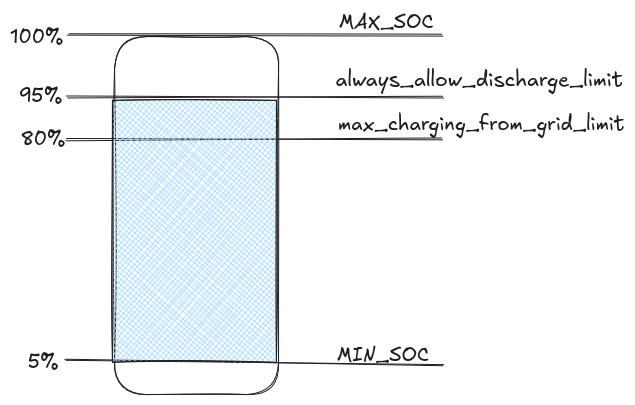

# How Batcontrol Works

Batcontrol is an intelligent battery management system that optimizes your home energy storage by predicting energy prices, solar production, and consumption patterns. It automatically controls your battery inverter to minimize electricity costs.

## Core Principle

The fundamental idea is simple: **charge your battery when electricity is cheap and use stored energy when electricity is expensive**. However, the implementation requires sophisticated forecasting and decision-making logic.

## System Architecture

### Main Components

1. **Forecasting Engines**: Gather predictions for prices, solar production, and consumption
2. **Logic Engine**: Calculates optimal battery control decisions
3. **Inverter Interface**: Controls your battery inverter
4. **External APIs**: Integrates with MQTT, evcc, and Home Assistant

### Operation Cycle

Batcontrol runs in a continuous loop, evaluating conditions **every 3 minutes**:

```
1. Fetch Forecasts → 2. Calculate Optimal Strategy → 3. Control Inverter → 4. Wait 3 Minutes → Repeat
```

## Forecasting System

Batcontrol combines three critical forecasts to make intelligent decisions:

### 1. Electricity Price Forecast
- **Source**: Dynamic tariff providers (Tibber, aWATTar, evcc, energyforecast.de, static tariff zones) — see [Dynamic Tariff Provider](../configuration/dynamic-tariff-provider.md)
- **Data**: Hourly electricity prices for the next 24-48 hours
- **Purpose**: Identifies when electricity is cheapest for charging

### 2. Solar Production Forecast
- **Source**: Solar forecast APIs (Forecast.Solar, Solarprognose, evcc, HomeAssistant Solar Forecast ML) — see [Solar Forecast](../configuration/solar-forecast.md)
- **Data**: Expected PV generation based on weather predictions
- **Configuration**: Your PV system specifications (kWp, orientation, location)
- **Purpose**: Predicts available solar energy

### 3. Consumption Forecast
- **Source**: Load profile CSV file scaled to your annual consumption, or your actual historical data via the HomeAssistant API — see [Consumption Forecast](../configuration/consumption-forecast.md)
- **Data**: Expected household energy usage patterns
- **Purpose**: Estimates energy demand throughout the day

### Net Consumption Calculation

The key metric is **Net Consumption = Consumption - Solar Production**:
- **Positive values**: You need energy from grid/battery
- **Negative values**: You have surplus solar energy

## Decision Logic

Based on the forecasts and current battery state, batcontrol puts your inverter into one of four modes:

### Mode 10: DISCHARGE ALLOWED (Normal Operation)
- **When**: Energy is currently expensive OR battery is sufficiently charged
- **Behavior**:
  - Battery can discharge to meet household demand
  - Surplus solar energy charges battery (respects `max_pv_charge_rate`)
  - Excess energy feeds into grid
- **Always Active**: When SOC > `always_allow_discharge_limit` (typically 90%)

### Mode 8: LIMIT BATTERY CHARGE RATE (Peak Shaving)
- **Requires**: version 0.8.0+ , Logic type `next` must be selected in `battery_control.type`
- **When**: Peak shaving is enabled, PV is producing, and the battery should not fill up too quickly
- **Behavior**:
  - Battery **discharge is allowed** (handles household demand normally)
  - PV charging is **rate-limited** so the battery fills gradually instead of hitting 100% early in the day
  - Excess PV energy that cannot be stored at the limited rate feeds into the grid
- **Purpose**: Preserve free battery capacity so the battery can absorb maximal solar energy later in the day, avoiding unnecessary grid feed-in during midday PV peaks

### Mode 0: AVOID DISCHARGE (Energy Saving)
- **When**: Prices are rising and stored energy will be more valuable later
- **Behavior**:
  - Battery does not discharge
  - Grid provides additional energy needed
  - Direct solar consumption continues normally
- **Purpose**: Preserve battery energy for expensive periods

### Mode -1: CHARGE FROM GRID (Active Charging)
- **When**: Current prices are significantly lower than future prices
- **Behavior**:
  - Battery charges from grid at configured rate (`max_grid_charge_rate`)
  - Charging stops at `max_charging_from_grid_limit` (typically 89%)
- **Calculation**: Estimates required energy for upcoming expensive hours
- **Efficiency**: Accounts for 10-20% charge/discharge losses

## Price-Based Decision Making

### Key Parameters

**`min_price_difference`** (absolute): Minimum price difference in Euro to justify grid charging
- Example: 0.05 means current price must be ≥5 cents lower than future price

**`min_price_difference_rel`** (relative): Percentage-based price difference threshold
- Example: 0.10 means current price must be ≥10% lower than future price
- Helps avoid inefficient charging during high-price periods

**Final threshold**: `max(min_price_difference, current_price × min_price_difference_rel)`

### Advanced Price Logic

**Expert Mode** offers additional refinements:
- **Price Rounding**: Configurable precision for price comparisons
- **Softened Charging**: Earlier charging with relaxed price requirements
- **Charge Rate Multiplier**: Compensates for charging inefficiencies

## Battery Management

### SOC (State of Charge) Limits

**`always_allow_discharge_limit`** (default: 90%)
- Above this SOC, battery always discharges freely
- Prevents over-charging and ensures availability

**`max_charging_from_grid_limit`** (default: 80%)
- Maximum SOC for grid charging
- Must be lower than discharge limit to prevent oscillation

**`min_recharge_amount`** (default: 100Wh) (since 0.5.3)
- Minimum amount of energy that is needed to be recharged before starting to recharge.
- That prevents ditching between discharge + recharge on an increasing price situation. 

### Safety Constraints

The system validates configuration to prevent problematic behavior:
- `always_allow_discharge_limit` must be > `max_charging_from_grid_limit`
- If violated, `max_charging_from_grid_limit` is automatically lowered

## External Integrations

### EVCC Integration
- **Purpose**: Coordinate with electric vehicle charging
- **Function**: Can lock battery discharge when car is charging
- **Configuration**: Monitors charging status and adjusts battery limits

### MQTT/Home Assistant
- **Real-time Data**: Battery state, prices, forecasts
- **Remote Control**: Override modes and parameters
- **Auto-Discovery**: Automatic Home Assistant entity creation

## Error Handling

### Forecast Failures
- **Timeout**: If APIs fail for >10 minutes, defaults to discharge mode
- **Fallback Strategy**: Ensures battery remains usable during outages
- **Recovery**: Automatically resumes normal operation when APIs return

### Configuration Validation
- **Runtime Checks**: Validates parameter relationships
- **Automatic Corrections**: Adjusts conflicting settings
- **Comprehensive Logging**: Detailed operation logs for troubleshooting

## Configuration Flow

1. **Hardware Setup**: Configure inverter connection and credentials
2. **Location Setup**: PV system specifications and geographic location
3. **Consumption Profile**: Annual usage and load pattern
4. **Price Provider**: Dynamic tariff API configuration
5. **Battery Limits**: Discharge and charging thresholds
6. **Fine-Tuning**: Expert parameters and external integrations

## Battery Configuration Visualization


This diagram illustrates the relationship between the key battery SOC limits and how they control charging/discharging behavior.